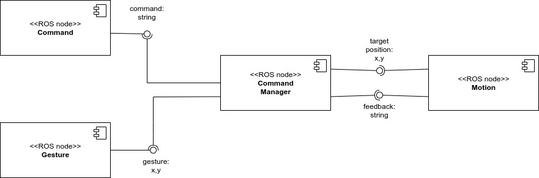
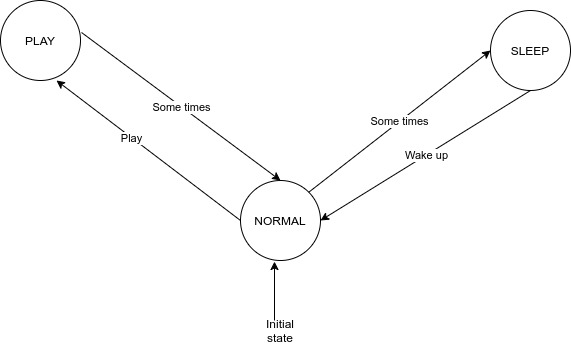

# Behavioral-Architecture
ROS architecture for simulating a robot into a discrete 2D enviroment. The robot has 3 behaviours:
- Play
- Sleep
- Normal

The user can interact with the robot via command and pointed gestures
# Software architecture and states diagrams
## Software architecture 
The architercture is composed by 4 components: 

- Command: simulate user vocal command

- Gesture: simulate user pointed gestures

- Motion: simulate robot motion

- Command manager: implement robot behaviors through a FSM

<p align="center">
  
</p>

## State diagram
The finite state machine is composed by 3 state (robot behaviours):

- PLAY: robot moves from person position to pointed gestures and viceversa

- NORMAL (initial state): robot moves in a random ways

- SLEEP: robot goes to home position and then goes to NORMAL state

<p align="center">
  
</p>

## ROS messages and parameters
The messages are:

- `Point`: 2D position used for pointed gestures and target position
- `String`: used for user command and feedback from "motion" component

The parameters are:

- `home_pos_x,home_pos_x`: define the home position in the map (double)
- `person_pos_x,person_pos_y`: define the person  position in the map (double)
- `map_x,map_y`: define the dimensions of the map (integer)
- `min_delay_command,max_delay_command`: define the min and max delay for sending the command "play" (double)
- `min_delay_gesture,max_delay_gesture`: define the min and max delay for sending the pointed gesture (double)
- `min_delay_robot_motion,max_delay_robot_motion`: define the min and max delay for simulating the robot motion (double)
- `min_transition_play_normal,max_transition_play_normal`: define the min and max delay to trasit between PLAY and NORMAL (integer)
- `min_transition_normal_sleep,max_transition_normal_sleep`: define the min and max delay to trasit between NORMAL and SLEEP (integer)
- `min_sleep_delay,max_sleep_delay`: define the min and max delay for the SLEEP state (double)


# Packages and files
There are 3 packages:

- `Sensoring`: contains the [command.py](sensoring/src/command.py) and [gesture.py](sensoring/src/gesture.py) files used to simulate the user command and pointed gestures
- `Robot control`: contains the [motion.py](robot_control/src/motion.py) file used to simulate robot motion
- `Command manager`: contains the [command_manager.py](manager/src/command_manager) file that implements the FSM of robot behaviours

# Installation and running
In order to run this software, the following prerequisities are needed:
- [ROS Noetic](http://wiki.ros.org/noetic)
- [smach](http://wiki.ros.org/smach)

Before running the software, you must have all files as executable otherwise you can make them executable with the following command
```
cd <your_workspace>/src/Behavioral-Architecture
chmod +x sensoring/src/*
chmod +x robot_control/src/*
chmod +x manager/src/*
```
To run the software
```
cd <your_workspace>/src/Behavioral-Architecture
roslaunch launch_file.launch
```

# Working hypothesis and environment
The robot interact with a human via a command and pointed gestures. It moves inside a 2D discrete enviroment. Both robot targets position and pointed gestures belongs to the map. The robot has 3 behaviours: Play,Normal,Sleep. The robot can receive any command while executing PLAY state and it can receive any command or pointed gesture while executing SLEEP state but all of them are ignored while executing one of the two states. The initial state is NORMAL. The only command is "play". There two predifined positions inside the map ("Person" and "Home" position) that cannot be changed during the execution.

# System's features
- Specify different dimensions of the map
- It is possibile to define different delays for the simulation

# System's limitations
There isn't a graphical interface for viewing the map and the robot motion.

# Possible technical Improvements
- Add other behaviours to the robot
- Use a graphical interface for viewing the simulation

# Author and contact
[Simone Voto](https://github.com/Cavalletta98) - simone.voto98@gmail.com